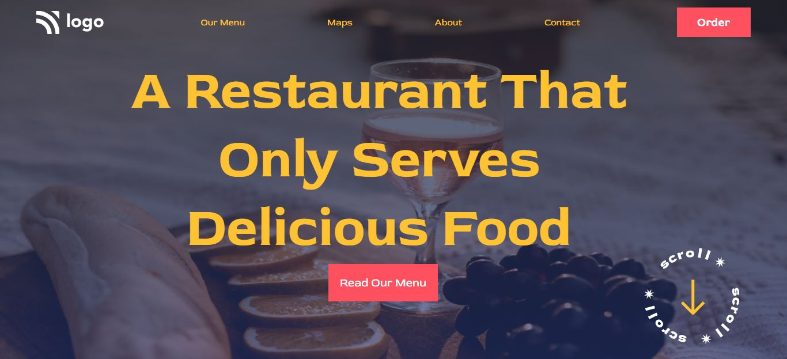

# Street Style Landing Page   
  
 This is a Food Restaurant page made for learning purposes using `CORE CSS` and `HTML`. 

Made by - **Robin Khilery**

Duration : **3 Hours**

***
 
## :clipboard: Learnings
Learnt  about `DOM Structure` ,effective implementation of `backgound-image` property and  `linear-gradient()` function.

## Deployed Link
 [click here to see deployed version](https://street-style-link.netlify.app/ "Click to Visit Link") 

## Screenshot

 